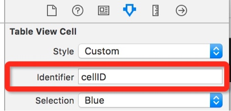

# UITableView 表格视图
UITableViewCell的创建原理和方法

当没有设置重用cell时，遵循*用到时再创建，不用时销毁*的原理：

1. 第一次运行tableView的时候，创建撑满屏幕视线的cell数量
2. 当滚动时候，进入视线的cell就会被创建，退出视线的cell就会被销毁，重复不断的创建销毁。

当设置重用cell时：

1. 第一次运行tableView的时候，先从缓存存池中查找可循环利用的cell，如果没有，创建撑满屏幕视线的cell数量

1. 当滚动时候，退出视线的cell就会放入缓存池中，进入视线的cell就会从缓存池中取出重用。

1. 如果不同样式的cell，系统就不知道从缓存池中取出哪个cell。因此在cell中设置indentifier标识，系统根据标识从缓存池中查找可循环利用的cell

### 重用cell的方法
**重用cell的创建方法一**

1.先根据cell的标识去缓存池中查找可循环利用的cell
	
```swift
tableView.dequeueReusableCellWithIdentifier("cellID")
```

2.如果cell为nil（缓存池找不到对应的cell），创建新的带标识的cell

```swift
if cell == nil {
	cell = UITableViewCell(style: .Default, reuseIdentifier: "cellID")
}
```

3.设置cel操作（添加数据）
```swift
cell?.textLabel?.text = "cell"
```
	
**重用cell的创建方法二**

1.注册一个带标识的cell
	
```swift
tableView.registerClass(UITableViewCell.classForCoder(), forCellReuseIdentifier: "cellID")
```

2.首先系统会根据cell的标示符去缓存池中查找可循环利用的cell，**如果缓存池里没有，就会调用第一步注册的cell创建带标识的cell**
 
```swift
let cell = tableView.dequeueReusableCellWithIdentifier("cellID")
```

3.设置cel操作（添加数据）

```swift
cell?.textLabel?.text = "cell"
```
	
**重用cell的创建方法三**

1.在storyboard中设置UITableView的 Prototype cells


2.在storyboard中设置重用标识


  
3.在代码中根据cell的标识去缓存池中查找可循环利用的cell - **如果缓存池中没有cell，就会调用storyboard中设置带标识的cell创建cell**

## 数据更新：添加、删除、更改
- tableView中添加、删除、更改cell数据，只需要操作模型数据
- 然后调用重载数据方法，告诉tableView模型数据发生了改变，重新调用代理方法。

### 批量操作方法例子
**自定义批量操作**

**系统自带批量操作**

- 允许在编辑模式进行多项选择
   
```swift
tableView.allowsMultipleSelectionDuringEditing = true
```

- 点击删除方法里实现下面步骤
  1.获取所有被选中的行数组
```swift
let indexPaths = tableView.indexPathsForSelectedRows
```

2.遍历所有的选中的行数组，添加到新建的数组中
```swift
var deleteddatas = [Int]()
for path in indexPaths! {
		deleteddatas.append(path.row)
}
```

3.删除模型数据
```swift
datasModel.removeObjectsInArray(deleteddatas)
```

4.刷新表格
```swift
tableView.reloadData()
```
		
### 加载更多的写法

## 属性 ------
**外观属性**
高度 - 代理没有设置高度的话，按此属性的数值为准

### 行高

```swift
public var rowHeight: CGFloat
```

### 组头部高度

```swift
public var sectionHeaderHeight: CGFloat
```

###组尾部高度

```swift
public var sectionFooterHeight: CGFloat
```

### 背景图片

```swift
public var backgroundView: UIView?
```

###分割线内边距
 
```swift
public var separatorInset: UIEdgeInsets
```

###分割线样式

```swift
public var separatorStyle: UITableViewCellSeparatorStyle
```

###分割线颜色
 
```swift
public var separatorColor: UIColor?
```

### 表格的头部视图
 
```swift
public var tableHeaderView: UIView? 
```

### 表格的尾部视图
 
```swift
public var tableFooterView: UIView?
```
- 设置这个可以实现有数据的时候才需要分割线


**编辑属性**
### 编辑状态
 
```swift
public var editing: Bool  // default is NO.
```

### 选择状态
 
```switch
public var allowsSelection: Bool // default is YES.
```

### 多项选择状态

```swift
public var allowsMultipleSelection: Bool // default is NO.
```
### 编辑状态是否允许选择

```swift
public var allowsSelectionDuringEditing: Bool // default is NO.
```

### 编辑状态是否允许多项选择

```swift
public var allowsMultipleSelectionDuringEditing: Bool // default is NO.
```

**信息属性**

### 组的数量

```swift
public var numberOfSections: Int { get }
```

**选择属性**

### 选中行的索引

```swift
public var indexPathForSelectedRow: NSIndexPath? { get }
```

### 选中行的索引数组

```swift
public var indexPathsForSelectedRows: [NSIndexPath]? { get }
```

## 方法 ------
**信息获取**
### 获取组的行数

```swift
public fund numberOfRowsInSection(section: Int) -> Int
```
### 获取组的Rect
 
```swift
public fund rectForSection(section: Int) -> CGRect
```

### 获取组的头部Rect

```swift
public fund rectForHeaderInSection(section: Int) -> CGRect
```

### 获取组的尾部Rect
 
```swift
public fund rectForFooterInSection(section: Int) -> CGRect
```

### 获取行的Rect

```swift
public fund rectForRowAtIndexPath(indexPath: NSIndexPath) -> CGRect
```

### 获取行的cell

```swift
public fun cellForRowAtIndexPath(indexPath: NSIndexPath) -> UITableViewCell? 
```

### 获取组的头部视图

```swift
public fund headerViewForSection(section: Int) -> UITableViewHeaderFooterView?
```

### 获取组的尾部视图

```swift
public fund footerViewForSection(section: Int) -> UITableViewHeaderFooterView?
```

### 滚动到行的索引位置

```swift
public fund scrollToRowAtIndexPath(indexPath: NSIndexPath, atScrollPosition scrollPosition: UITableViewScrollPosition, animated: Bool)
```

**数据重载**
### 重新加载数据

```swfit
public fund reloadData()
```
- 会重新调用tableview代理方法重新刷新cell数据并呈现，相对损耗
- 如果只插入和删除当行，建议选择下列介绍的方法

### 重载组标题数据

```swift
public fund reloadSectionIndexTitles()
```

**插入/删除/重载 - 方法中默认重新加载数据**

### 开始更新

```swift
public fund beginUpdates()
```
- 对表格控件执行多个连续的插入、删除、移动操作前调用这个方法开始更新

### 结束更新

```swift
public fund endUpdates()
```
- 对表格控件执行多个连续的插入、删除、移动操作之后调用这个方法结束更新

### 插入组
 
```swift
public fund insertSections(sections: NSIndexSet, withRowAnimation animation: UITableViewRowAni
mation)
```

### 删除组

```swift
public fund deleteSections(sections: NSIndexSet, withRowAnimation animation: UITableViewRowAnimation)
```

### 重载组

```swift
public fund reloadSections(sections: NSIndexSet, withRowAnimation animation: UITableViewRowAnimation)
```

### 移动组

```swift
public fund moveSection(section: Int, toSection newSection: Int)
```

### 插入行

```swift
public fund insertRowsAtIndexPaths(indexPaths: [NSIndexPath], withRowAnimation animation: UITableViewRowAnimation)
```

### 删除行

```swift
public fund deleteRowsAtIndexPaths(indexPaths: [NSIndexPath], withRowAnimation animation: UITableViewRowAnimation)
```

### 重载行

```swift
public fund reloadRowsAtIndexPaths(indexPaths: [NSIndexPath], withRowAnimation animation: UITableViewRowAnimation)
```

### 移动行

```swift
public fund moveRowAtIndexPath(indexPath: NSIndexPath, toIndexPath newIndexPath: NSIndexPath)
```

**编辑方法**

### 设置编辑状态

```swift
public fund setEditing(editing: Bool, animated: Bool)
```

**选择 - 选中或取消选中某行，这个方法不回调用委托方法，也不会发送通知**

### 选中某行

```swift
public fund selectRowAtIndexPath(indexPath: NSIndexPath?, animated: Bool, scrollPosition: UITableViewScrollPosition)
```

### 取消选中某行

```swift
public fund deselectRowAtIndexPath(indexPath: NSIndexPath, animated: Bool)
```

### 重用cell方法

```swift
public fund dequeueReusableCellWithIdentifier(identifier: String) -> UITableViewCell?
```
 
```swift
public fund dequeueReusableCellWithIdentifier(identifier: String, forIndexPath indexPath: NSIndexPath) -> UITableViewCell
```

### 重用头部尾部方法

```swift
public func dequeueReusableHeaderFooterViewWithIdentifier(identifier: String) -> UITableViewHeaderFooterView? 
```

### 通过Nib注册cell方法
  
```swift
public func registerNib(nib: UINib?, forCellReuseIdentifier identifier: String)
```
registerNib方法的步骤
	 
```swift
let nib = UINib(nibName: "testCell", bundle: NSBundle.mainBundle())
self.tableView.registerNib(nib, forCellReuseIdentifier: "cellID")
```

### 通过类注册cell方法

```swift
public func registerClass(cellClass: AnyClass?, forCellReuseIdentifier identifier: String)
```

### 注册头部尾部方法
 
```swift
public func registerNib(nib: UINib?, forHeaderFooterViewReuseIdentifier identifier: String)
```


```swift
public func registerClass(aClass: AnyClass?, forHeaderFooterViewReuseIdentifier identifier: String)
```

## UITableViewDelegate ---
**显示监听代理**

**将要显示**

### 将要显示cell
 
```swift
optional public fund tableView(tableView: UITableView, willDisplayCell cell: UITableViewCell, forRowAtIndexPath indexPath: NSIndexPath)
```

### 将要显示头部视图

```swift
optional public fund tableView(tableView: UITableView, willDisplayHeaderView view: UIView, forSection section: Int)
```
### 将要显示尾部视图
 
```swift
optional public fund tableView(tableView: UITableView, willDisplayFooterView view: UIView, forSection section: Int)
```

**完成显示**

### 完成cell显示

```swift
optional public fund tableView(tableView: UITableView, didEndDisplayingCell cell: UITableViewCell, forRowAtIndexPath indexPath: NSIndexPath)
```

### 完成头部视图显示

```swift
optional public fund tableView(tableView: UITableView, didEndDisplayingHeaderView view: UIView, forSection section: Int)
```

### 完成尾部视图显示

```swift
optional public fund tableView(tableView: UITableView, didEndDisplayingFooterView view: UIView, forSection section: Int)
```

**设置高度代理**

### 每行高度
 
```swift
optional public fund tableView(tableView: UITableView, heightForRowAtIndexPath indexPath: NSIndexPath) -> CGFloat
```

### 组头部高度

```swift
optional public fund tableView(tableView: UITableView, heightForHeaderInSection section: Int) -> CGFloat
```

### 组尾部高度

```swift
optional public fund tableView(tableView: UITableView, heightForFooterInSection section: Int) -> CGFloat
```

**设置估计高度代理**
- 默认情况下，系统先调用`public fund tableView(tableView: UITableView, heightForRowAtIndexPath indexPath: NSIndexPath) -> CGFloat`方法设置每行的高度，再调用`fund tableView(tableView: UITableView, cellForRowAtIndexPath indexPath: NSIndexPath) -> UITableViewCell`方法创建cell

- 当调用了_设置估计高度_方法，系统就会先`fund tableView(tableView: UITableView, cellForRowAtIndexPath indexPath: NSIndexPath) -> UITableViewCell`方法创建cell，然后在调用`public fund tableView(tableView: UITableView, heightForRowAtIndexPath indexPath: NSIndexPath) -> CGFloat`方法设置每行的真实高度

- 好处：没调用这个方法，系统会一口气设置每行的高度，当调用估计高度方法，系统会根据需要设置每行的高度。

### 每行的估计高度
 
```swift
optional public func tableView(tableView: UITableView, estimatedHeightForRowAtIndexPath indexPath: NSIndexPath) -> CGFloat
```
### 每组的头部估计高度
 
```swift
optional public func tableView(tableView: UITableView, estimatedHeightForHeaderInSection section: Int) -> CGFloat
```

### 每组的尾部估计高度

```swift
optional public func tableView(tableView: UITableView, estimatedHeightForFooterInSection section: Int) -> CGFloat
```

**定制视图代理**

### 定制组头部

```swift
optional public fund tableView(tableView: UITableView, viewForHeaderInSection section: Int) -> UIView? 
```

### 定制组尾部

```swift
optional public fund tableView(tableView: UITableView, viewForFooterInSection section: Int) -> UIView?
```

### 动态附件代理

```swift
optional public fund tableView(tableView: UITableView, accessoryButtonTappedForRowWithIndexPath indexPath: NSIndexPath)
```

**选择监听代理**

**选中高亮监听**
- 如果设置_选中是否高亮_为true，会执行**完成显示高亮**和**完成不显示高亮**的监听。如果设置为false则不执行**选中高亮监听**。

### 选中是否高亮
 
```swift
optional public fund tableView(tableView: UITableView, shouldHighlightRowAtIndexPath indexPath: NSIndexPath) -> Bool
```

### 完成显示高亮
 
```swift
optional public fund tableView(tableView: UITableView, didHighlightRowAtIndexPath indexPath: NSIndexPath)
```

### 完成不显示高亮

```swift
optional public fund tableView(tableView: UITableView, didUnhighlightRowAtIndexPath indexPath: NSIndexPath)
```

**选中监听**
选中监听的过程
1. 首次选中: 将要选中 —> 完成选中
2. 再次选中: 将要选中 -> 将要取消选中 -> 完成取消选中 - 完成选中

### 将要选中
 
```swift
optional public fund tableView(tableView: UITableView, willSelectRowAtIndexPath indexPath: NSIndexPath) -> NSIndexPath?
```
- 当不需要某一个有选中触发事件时，可以在某行返回nil

### 将要取消选中
 
```swift
optional public fund tableView(tableView: UITableView, willDeselectRowAtIndexPath indexPath: NSIndexPath) -> NSIndexPath?
```
- 当不需要某一行有取消触发事件时，可以在某行返回nil

### 完成选中
 
```swift
optional public fund tableView(tableView: UITableView, didSelectRowAtIndexPath indexPath: NSIndexPath)
```

### 将要完成选中
 
```swift
optional public fund tableView(tableView: UITableView, didDeselectRowAtIndexPath indexPath: NSIndexPath)
```

**编辑代理**
**编辑设置**

### 设置编辑样式 - 这个方法决定了编辑模式时，每一行的编辑类型
 
```swift
optional public fund tableView(tableView: UITableView, editingStyleForRowAtIndexPath indexPath: NSIndexPath) -> UITableViewCellEditingStyle
```


- 参数 UITableViewCellEditingStyle
  1. `case None`  此编辑样式没有插入或者删除图标，可配合编辑状态是否缩进使用
  2. `case Delete`  删除 
  3. `case Insert`  插入
  
- 使用方法：
  1. 设置编辑状态`tableView.editing`为`true`
  2. 调用代理方法`optional public fund tableView(tableView: UITableView, commitEditingStyle editingStyle: UITableViewCellEditingStyle, forRowAtIndexPath indexPath: NSIndexPath)`
  3. 自身方法中设置返回`UITableViewCellEditingStyle`的样式

### 设置删除按钮名称
 
```swift
optional public fund tableView(tableView: UITableView, titleForDeleteConfirmationButtonForRowAtIndexPath indexPath: NSIndexPath) -> String?
```

### 设置滑动显示多个按钮
 
```swift
optional public fund tableView(tableView: UITableView, editActionsForRowAtIndexPath indexPath: NSIndexPath) -> [UITableViewRowAction]? 
```
- 返回`[UITableViewRowAction]`
  1. 可以设置按钮的样式、显示的文字、背景色、和点击事件
  2. 最先放入的数据按钮显示在最右侧
  3. 自定侧滑按钮，系统自带的删除按钮就被替代。

### 设置编辑状态是否缩进

```swift
optional public fund tableView(tableView: UITableView, shouldIndentWhileEditingRowAtIndexPath indexPath: NSIndexPath) -> Bool
```
- 该方法决定了cell处于被编辑状态是否应该缩进，默认cell处于编辑状态都是缩进。

### 编辑监听
 
```swift
optional public fund tableView(tableView: UITableView, willBeginEditingRowAtIndexPath indexPath: NSIndexPath)
```
- 当实现了DataSource的数据操作方法，编辑监听才会调用
  将要编辑

### 完成编辑
 
```swift
optional public fund tableView(tableView: UITableView, didEndEditingRowAtIndexPath indexPath: NSIndexPath)
```

#### 移动/重新排序
 
```swift
optional public fund tableView(tableView: UITableView, targetIndexPathForMoveFromRowAtIndexPath 
sourceIndexPath: NSIndexPath, toProposedIndexPath proposedDestinationIndexPath: NSIndexPath) -> NSIndexPath
```

## UITableViewDataSource ---
**数据呈现设置**

### 总共多少组数据

```swift
optional public fund numberOfSectionsInTableView(tableView: UITableView) -> Int
```

### 每组多少行
	 
```swift
public fund tableView(tableView: UITableView, numberOfRowsInSection section: Int) -> Int
```

### 每行显示的内容
	 
```swift
public fund tableView(tableView: UITableView, cellForRowAtIndexPath indexPath: NSIndexPath) -> UITableViewCell
```
### 组头部标题
	 
```swift
optional public fund tableView(tableView: UITableView, titleForHeaderInSection section: Int) -> String?
```
### 组尾部标题
	 
```swift
optional public fund tableView(tableView: UITableView, titleForFooterInSection section: Int) -> String?
```

### 设置编辑状态
 
```swift
optional public fund tableView(tableView: UITableView, canEditRowAtIndexPath indexPath: NSIndexPath) -> Bool
```

### 设置移动/排序状态

```swift
optional public fund tableView(tableView: UITableView, canMoveRowAtIndexPath indexPath: NSIndexPath) -> Bool
```

**索引 - 数据源代理**
### 组的索引标题
 
```swift
optional public fund sectionIndexTitlesForTableView(tableView: UITableView) -> [String]? 
```

**数据操作 - 数据源代理**

### 添加/删除
 
```swift
optional public fund tableView(tableView: UITableView, commitEditingStyle editingStyle: UITableViewCellEditingStyle, forRowAtIndexPath indexPath: NSIndexPath)
```
- 只要实现这个方法，就会实现左划出现删除按钮的功能

### 移动

```swift
optional public fund tableView(tableView: UITableView, moveRowAtIndexPath sourceIndexPath: NSIndexPath, toIndexPath destinationIndexPath: NSIndexPath)
```