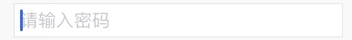
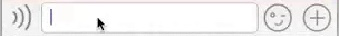

# UITextField 文本框
## 属性 ------
### 占位符
 
```swift
public var placeholder: String?
```



### 左边视图
 
```swift
public var leftView: UIView? 
```

- 给leftView赋上视图，必须设置视图模式才会显示，默认不显示。
- 一般可以用来做光标右移一段距离



### 左边视图模式

```swift
public var leftViewMode: UITextFieldViewMode
```
- 默认为`case Never`不显示

### 弹出视图

```swift
public var inputView: UIView?
```

### 弹出附加视图

```swift
public var inputAccessoryView: UIView?
```

### UITextFieldDelegate ------
#### 是否允许开始编辑
 
```swift
optional public func textFieldShouldBeginEditing(textField: UITextField) -> Bool // return NO to disallow editing.
```
#### 开始编辑
 
```swift
optional public func textFieldDidBeginEditing(textField: UITextField) // became first responder
```
#### 是否允许结束编辑
 
```swfit
optional public func textFieldShouldEndEditing(textField: UITextField) -> Bool
```
#### 结束编辑
 
```swift
optional public func textFieldDidEndEditing(textField: UITextField) 
```
#### 是否允许用户输入文字
 
```swift
optional public func textField(textField: UITextField, shouldChangeCharactersInRange range: NSRange, replacementString string: String) -> Bool
```
#### 是否允许删除
 
```swift
optional public func textFieldShouldClear(textField: UITextField) -> Bool
```
#### 是否允许“返回”- 一般用来隐藏键盘
 
```swift
optional public func textFieldShouldReturn(textField: UITextField) -> Bool
```

## 枚举 ------
### 左边视图模式

```swift
public enum UITextFieldViewMode : Int {
     
     case Never
     case WhileEditing
     case UnlessEditing
     case Always
}
```