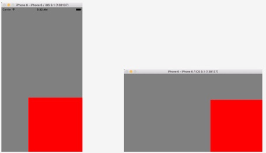

# UIView 视图
## 属性 ------
### 是否激活多指触摸 - 默认是单指触摸

```swift
public var multipleTouchEnabled: Bool // default is NO
```

### 获取自己的父控件对象

```swift
public var superview: UIView? { get }
```

### 获取自己的所有子控件对象
 
```swift
public var subviews: [UIView] { get }
```
- subviews 是个数组
- 数组元素的顺序决定着子控件的显示层级顺序（下标越大的，显示在越上面）

### 形变属性

```swift
public var transform: CGAffineTransform
```

- transform本质是修改控件的frame 
- 能完成的功能：平移、缩放、旋转

### 位置尺寸
#### frame属性：表示控件矩形框在父控件中的位置和尺寸（以父控件的左上角为坐标原点）
 
```swift
public var frame: CGRect
```

#### bounds属性：表示控件矩形框在父控件中的位置和尺寸（以本身的左上角为坐标原点）

```swift
public var bounds: CGRect
```
- 获取尺寸的时候，也可以通过bounds获取。获取位置坐标用frame 

#### center属性：控制中点的位置（以父控件的左上角为坐标原点）

```swift
public var center: CGPoint
```

### 自动调整尺寸 - 布局方式之一（iPad出现、iPhone横屏出现Autoresizing技术）
 
```swift
public var autoresizingMask: UIViewAutoresizing
```

UIViewAutoresizing是一个结构体，包含以下几个属性：
 
```swift
typedef NS\_OPTIONS(NSUInteger, UIViewAutoresizing) {
	 UIViewAutoresizingNone = 0,         // 默认位置尺寸
	 
	 UIViewAutoresizingFlexibleLeftMargin = 1 << 0, // 可变的左边距
	 
	 UIViewAutoresizingFlexibleWidth = 1 << 1, // 可变的宽度
	 
	 UIViewAutoresizingFlexibleRightMargin = 1 << 2, // 可变的右边距
	 
	 UIViewAutoresizingFlexibleTopMargin = 1 << 3, // 可变的上边距
	 
	 UIViewAutoresizingFlexibleHeight = 1 << 4,  // 可变的高度
	 
	 UIViewAutoresizingFlexibleBottomMargin = 1 << 5 // 可变的下边距
 }
```

**自动调整尺寸的用法**

1.创建控件

```swift
let wh: CGFloat = 250
let x = self.view.frame.size.width - wh
let y = self.view.frame.size.height - wh
let redView = UIView(frame: CGRect(x:x , y: y, width: 250, height: 250))
redView.backgroundColor = UIColor.redColor()
```
	
2.设置控件的自动调整尺寸属性
	
```swift
// 自动尺寸布局
redView.autoresizingMask = [.FlexibleLeftMargin, .FlexibleTopMargin]
```
	
3.添加控件到父控件
```swift
self.view.addSubview(redView)
```
	
4.运行效果  
      



### 约束组

```swift
public var constraints: [NSLayoutConstraint] { get }
```

## 方法 ------
### 操控子控件的方法
#### 从父控件中移除子控件 - 从数组中后面往前删除子控件
 
```swift
public func removeFromSuperview()
```

#### 将子控件插入到subviews数组的index位置
 
```swift
public func insertSubview(view: UIView, atIndex index: Int)
```

#### 交换子控件的位置
 
```swift
public func exchangeSubviewAtIndex(index1: Int, withSubviewAtIndex index2: Int)
```

#### 添加一个子控件
 
```swift
public func addSubview(view: UIView)
```

#### 在指定索引的子控件上面插入一个子控件
 
```swift
public func insertSubview(view: UIView, atIndex index: Int)
```

#### 将子控件插入到指定指子控件下面
 
```swift
public func insertSubview(view: UIView, belowSubview siblingSubview: UIView)
```

#### 将子控件插入到指定指子控件上面
 
```swift
public func insertSubview(view: UIView, aboveSubview siblingSubview: UIView)
```

#### 将子控件放到数组的最后面，显示在最上面
 
```swift
public func bringSubviewToFront(view: UIView)
```

#### 将子控件放到数组的最下面，显示在最后面
 
```swift
public func sendSubviewToBack(view: UIView)
```

### 根据一个tag标识找出对应的控件（一般都是子控件)
 
```swift
public func viewWithTag(tag: Int) -> UIView?
```

- 会先判断父View的tag值是否一样，如果父View的tag值一样，就返回自己

### 布局子控件方法

```swift
public func layoutSubviews()
```

- 这个方法用来布局子控件
- 当控件本身的尺寸发生改变的时候，系统会调用这个方法
- 一般重写这个方法设置子控件的frame
- 为什么要在这个方法布局子控件:因为只要一调用这个方法，就表示父控件的尺寸确定

### 添加约束

```swift
public func addConstraint(constraint: NSLayoutConstraint)
```
 
```swift
public func addConstraints(constraints: [NSLayoutConstraint])
```

### 移除约束
 
```swift
public func removeConstraint(constraint: NSLayoutConstraint)
```
 
```swift
public func removeConstraints(constraints: [NSLayoutConstraint])
```

### 自适应尺寸
 
```swift
public func sizeToFit()
```
- UILabel自适应尺寸只对text适用，对富文本不适用。

### 绘图图形
 
```swift
public func drawRect(rect: CGRect)
```
**注意：只要一调用drawRect方法，就会把之前的绘图内容全部清空**
重写方法，然后在这个方法中

1. 获取图形上下文
2. 创建路径（描述路径）
3. 添加路径到图形上下文
4. 渲染图形上下文

什么时候调用：
当这个view要显示的时候才会调用`func drawRect(rect: CGRect)`方法绘制图形，`rect`是当前控件的bounds

这个方法显示时候只调用一次，通过`func setNeedsLayout()`可以重绘

**注意：**`func drawRect(rect: CGRect)`方法不能手动调用，因为图形上下文我们自己创建不了，只能系统帮我们创建，并且传递给我们

### 重绘

```swift
public func setNeedsDisplay()
```
- 系统会先创建与view相关联的图形上下文，然后再调用`func drawRect(rect: CGRect)`方法

### 在绘制周期发生之前执行布局

```swift
public func setNeedsLayout()
```
 
```swift
public func layoutIfNeeded() // 强制布局
```

### 事件传递的时候调用，寻找最合适的view来处理事件
 
```swift
public func hitTest(point: CGPoint, withEvent event: UIEvent?) -> UIView?
```

- 什么时候调用：当事件传递给控件的时候，就会调用控件的这个方法，去寻找最合适的view

- point：当前的触摸点，point这个点的坐标系就是方法调用者的坐标

### 判断触摸点是否在方法调用者（控件）上面
 
```swift
public func pointInside(point: CGPoint, withEvent event: UIEvent?) -> Bool
```

### 当前控件坐标系上的点转换到指定控件上

```swift
public func convertPoint(point: CGPoint, toView view: UIView?) -> CGPoint
```

### 添加手势识别
 
```swift
public func addGestureRecognizer(gestureRecognizer: UIGestureRecognizer)
```

### 移除手势识别

```swift
public func removeGestureRecognizer(gestureRecognizer: UIGestureRecognizer)
```

## 类方法 ----------
### 弹簧效果的动画
 
```swift
public class func animateWithDuration(duration: NSTimeInterval, delay: NSTimeInterval, usingSpringWithDamping dampingRatio: CGFloat, initialSpringVelocity velocity: CGFloat, options: UIViewAnimationOptions, animations: () -> Void, completion: ((Bool) -> Void)?)
```
- usingSpringWithDamping： 弹簧系数，系数越小，弹簧效果越明显
- velocity: 弹簧速率

### 设置控件主层的类型
 
```swift
public class func layerClass() -> AnyClass // default is [CALayer class]. Used when creating the underlying layer for the view.
```
- 可以重写更改返回图层的类型，如返回复制图层