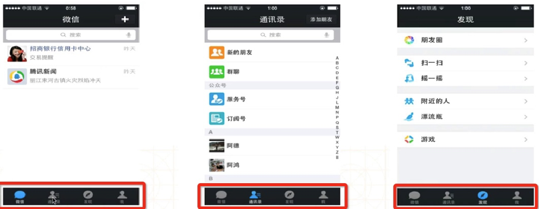
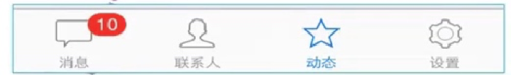

# UITabBarController 标签栏控制器
跟UINavigationController类似，UITabBarController也可以轻松地管理多个控制器，轻松完成控制器之间的切换，典型的例子就是QQ、微信等应用



- UITabBar的高度是49

**UITabBarController的view结构**



**UITabBarController的简单实用**

- 初始化UITabBarController
- 设置UIWindow的rootViewController为UITabBarController
- 根据具体情况，通过addChildViewController方法添加对应个数的子控制器

# UITabBar
如果UITabBarController有n个子控制器，那么UITabBar内部就会有n个UITabBarButton作为子控件

如果UITabBarController有4个子控制器，那么UITabBar的结构大致如下图所示


# UIUITabBarItem
UITabBarButton里面显示什么内容，由对应的子控制器的UITabBarItem属性决定


## UIUITabBarItem 属性

UITabBarItem有以下属性影响着UITabBarButton的内容

### 标题文字
```swift
public var title: String?
```

### 图标
```swift
public var image: UIImage? 
```

### 选中时的图标
```swift
public var selectedImage: UIImage?
```

### 提醒数字
```swift
public var badgeValue: String? // default is nil
```