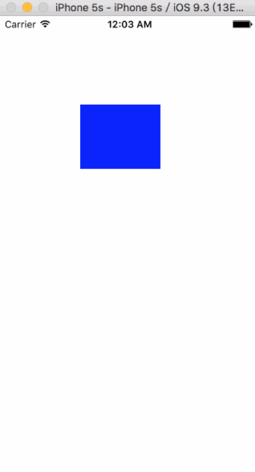
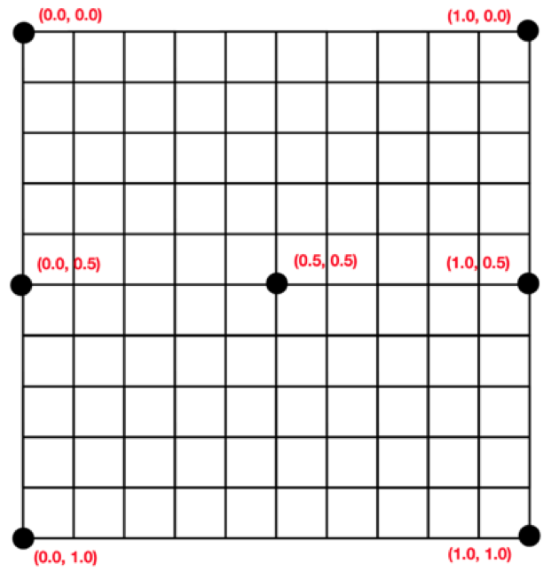

# CALayer 图层
在iOS中，你能看得见摸得着的对象基本都是UIView，比如一个按钮、一个文本标签、一个文本输入框、一个图标等等，这些都是UIView

其实UIView之所以能显示在屏幕上，完全是因为它内部的一个图层（CALayer）

在创建UIView对象时，UIView内部会自动创建一个图层（即CALayer对象），通过UIView的layer属性可以访问这个图层

当UIView需要显示到屏幕上时，会调用drawRect：方法进行绘图，并且会将所有内容绘制在自己的图层上，绘图完毕后，系统会将图层拷贝到屏幕上，于是就完成了UIView的显示

换句话说，UIView本身不具备显示的功能，是它内部的层才有显示功能

**通过操作CALayer对象，可以很方便调整UIView的一些外国属性，比如：阴影、圆角大小、边框宽度和颜色...等，还可以给图层添加动画，来实现一些比较酷炫的效果。**

**一、关于CALayer的疑惑**

- 首先
  
  CALayer是定义在QuartzCore框架中
  
  CGImageRef、CGColorRef两种数据类型是定义在CoreGraphics框架中的，UIColor、UIImage定义在UIKit框架中的

- 其次
  
  QuartzCore框架和CoreGraphics框架可以跨平台使用，在iOS和Mac OS X上都能使用，但是UIKit只能在iOS中使用

- 为了保证可移植性，QuartzCore不能使用UIImage和UIColor，只能使用CGImageRef和CGColorRef

**二、UIView和CALayer的选择**

- 通过CALayer，就能做出跟UIImageView一样的界面效果
- 既然CALAyer和UIView都能实现相同的显示效果，那究竟该选择谁好呢？
- 其实，对比CALayer，UIView多了一个事件处理的功能。也就是说，CALayer不能处理用户的触摸事件，而UIView可以
- 所以，如果显示出来的东西需要跟用户进行交互的话，用UIView；如果不需要跟用户交互，用UIView或则CALayer都可以
- 当然，CALayer的性能会高一些，因为它少了事件处理能力，更加轻量级

**三、隐式动画**

1.简单说明

- 每一个UIView内部都默认关联着一个CALayer，我们称这个layer为rootLayer（根层）
- 所有的非rootLayer，也就是手动创建的CALayer对象，都存在着隐式动画

> 当对非rootLayer的部分属性进行修改时，默认会产生一些动画效果
> 而这些属性称为Animatable Properties（可动画属性）

列举几个常见的Animatable Properties：
	
	bounds：用于设置CALayer的宽度和高度。修改这个属性会产生缩放动画
	
	backgroundColor：用于设置CALayer的背景色。修改这个属性会产生背景色的渐变动画
	
	position：用于设置CALayer的位置。修改这个属性会产生平移动画

2.代码示例

```swift
import UIKit

class ViewController: UIViewController {
    
    var layer: CALayer!

    override func viewDidLoad() {

        layer = CALayer()
      
        layer.bounds = CGRectMake(0, 0, 100, 80)
        layer.backgroundColor = UIColor.blueColor().CGColor
        layer.position = CGPoint(x: 150, y: 150)

        view.layer.addSublayer(layer)
    }
    
    override func touchesBegan(touches: Set<UITouch>, withEvent event: UIEvent?) {
        
        // 演示隐式动画效果
        layer.position = CGPoint(x: 150, y: 300)
    }
}
```


关闭隐式动画

```swift
CATransaction.begin()
CATransaction.setDisableActions(true)
// 隐式动画      
layer.position = CGPoint(x: 150, y: 300)
        
CATransaction.commit()
```

## 属性 ---
### 锚点
 
```swift
public var anchorPoint: CGPoint
```

- 也称为定位点
- 决定着CALayer的position属性所指的位置
- 以自己的左上角为原点（0，0）
- 它的x、y取值范围都是0~1，默认值为（0.5，0.5）
- 默认旋转是根据锚点来进行旋转的

anchorPoint值对应layer的位置如下图：


### 位置

```swift
public var position: CGPoint
```

- 用来设置CALayer在父层中的位置
- 以父层的左上角为原点（0，0）到锚点的位置

### 图层形变
 
```swift
public var transform: CATransform3D
```

### 圆角半径
 
```swift
public var cornerRadius: CGFloat
```

- 默认是设置控件的主层边框

### 边框
 
```swift
public var borderWidth: CGFloat
```

### 边框颜色
 
```swift
public var borderColor: CGColor?
```

### 不透明度
 
```swift
public var opacity: Float
```

- 默认是1不透明，0为透明

### 阴影不透明度
 
```swift
public var shadowOpacity: Float
```

- 默认是0透明，1为不透明

### 阴影颜色
 
```swift
public var shadowColor: CGColor?
```

### 阴影偏移
 
```swift
public var shadowOffset: CGSize
```

### 阴影半径
 
```swift
public var shadowRadius: CGFloat
```

### 内容矩阵
 
```swift
public var contentsRect: CGRect
```

- 通过内容矩阵可以设置图片显示的范围
- 取值范围：0~1

## 方法 ---
### 是否超出裁剪，超出主层边框的内容全部裁剪掉
 
```swift
public var masksToBounds: Bool
```

- CALayer有sublayers 和 contents用于存放内容
- 默认是设置控件的主层边框，这个方法可以直接将超出主层边框的内容全部裁剪掉


### 截取到图形上下文，屏幕截图
 
```swift
public func renderInContext(ctx: CGContext)
```

- 调用某个view的layer的renderInContext方法即可

举个栗子：

```swift
// 1. 开启位图上下文
UIGraphicsBeginImageContext(self.view.bounds.size)
         
// 2. 截取屏幕
// 2.1 获取图形上下文
let context = UIGraphicsGetCurrentContext()
// 2.2 截图到图形上下文
self.view.layer.renderInContext(context!)
         
// 3. 生成图片
let image = UIGraphicsGetImageFromCurrentImageContext()
         
// 4. 保存图片
// 4.1 image转成data
let data = UIImagePNGRepresentation(image)
// 4.2 写入到桌面
data?.writeToFile("/Users/Ayong/Desktop/view.png", atomically: true)
         
// 5. 关闭位图上下文
UIGraphicsEndImageContext()
```