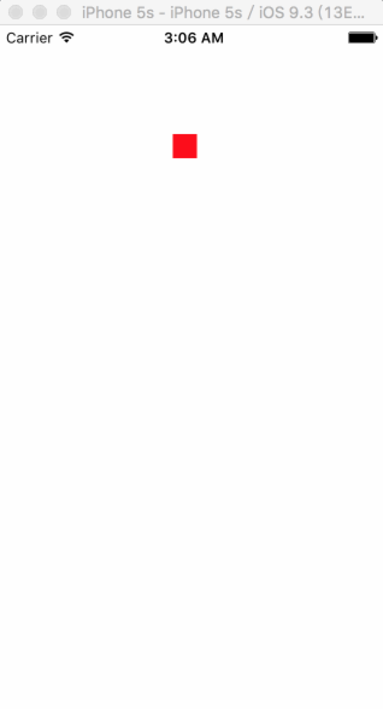

# CAKeyframeAnimation 关键帧动画

## 属性
### 一个数组的对象提供的动画的值
 
```swift
public var values: [AnyObject]?
```

- 数据的对象用NSValue进行包装

举个例子：
```swift
class ViewController: UIViewController {

    override func viewDidLoad() {
        super.viewDidLoad()
        
        let animation = CAKeyframeAnimation(keyPath: "position")
        
        let point1 = NSValue(CGPoint: CGPoint(x: 50, y: 100))
        let point2 = NSValue(CGPoint: CGPoint(x: 200, y: 100))
        
        animation.values = [point1, point2]
        animation.duration = 1.0
        animation.repeatCount = MAXFLOAT
        
        let redView = UIView(frame: CGRect(x: 0, y: 0, width: 20, height: 20))
        redView.backgroundColor = UIColor.redColor()
        
        view.addSubview(redView)
        
        redView.layer.addAnimation(animation, forKey: nil)
    }
}
```



### 一个数组的对象提供的动画的时间的值
 
```swift
public var keyTimes: [NSNumber]?
```

- 取值范围\[0,1]

### 动画路径
 
```swift
public var path: CGPath?
```