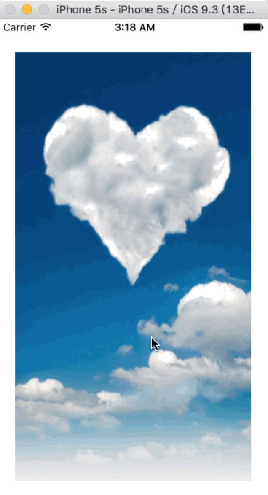

# CATransition 转场动画
CATransition用于做转场动画，能够为层提供移出屏幕和移入屏幕的动画效果。iOS比MacOS的转场动画效果少一点。
转场代码要和转场动画写在一起

UINavigationController就是通过CATransition实现了将控制器的视图推入屏幕的动画效果

## 属性
### 动画的过度类型
 
```swift
public var type: String
```

类型字符串      | 效果说明
----------------  |  ---------------
fade                 | 交叉淡化过渡
push                | 新视图把旧视图推出去 
moveIn            | 新视图移到旧视图上面
reveal              | 将旧视图移开,显示下面的新视图 
cube                | 立方体翻滚效果
oglFlip             | 上下左右翻转效果
suckEffect       | 收缩效果，如一块布被抽走
rippleEffect      | 水滴效果
pageCurl         | 向上翻页效果
pageUnCurl    | 向下翻页效果
cameraIrisHollowOpen  | 相机镜头打开效果
cameraIrisHollowClose | 相机镜头关闭效果

### 动画的过度方向
 
```swift
public var subtype: String?
```

### 动画的起点（在整体动画的百分比）
 
```swift
public var startProgress: Float
```

### 动画的终点(在整体动画的百分比）
 
```swift
public var endProgress: Float
```

举个例子：

```swift
import UIKit

class ViewController: UIViewController {

    @IBOutlet var imageV: UIImageView!
    var i = 1
    
    override func viewDidLoad() {
        super.viewDidLoad()
        
        self.imageV.image = UIImage(named: "\(i)")
    
    }

    override func didReceiveMemoryWarning() {
        super.didReceiveMemoryWarning()
        // Dispose of any resources that can be recreated.
    }
    
    override func touchesBegan(touches: Set<UITouch>, withEvent event: UIEvent?) {
        
        self.i += 1

        // 转场代码
        if self.i == 4 {
            self.i = 1
        }
        
        let image = UIImage(named: "\(i)")
        self.imageV.image = image
        
        // 转场动画
        let animation = CATransition()
        
        animation.type = "rippleEffect"
        
        animation.duration = 2
        
        self.imageV.layer.addAnimation(animation, forKey: nil)
    }
}
```

