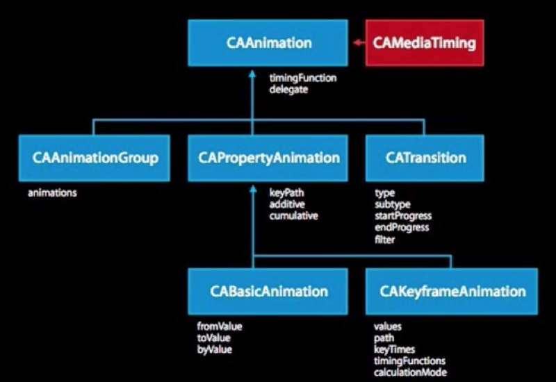

# Core Animation 核心动画
Core Animation它是一个组非常强大的动画处理API，使用它能做出非常炫丽的动画效果，而且往往事半功倍。也就是说，使用少量代码就可以实现非常强大的功能。

Core Animation可以用在Mac OS X和iOS平台

Core Animation的动画执行过程都是在后台操作的，不会阻塞主线程

> 注意：
> Core Animation是直接作用在CALayer上的，并非UIView

**核心动画继承结构**



**视图动画和核心动画的区别**

- 核心动画不会真实的改变图层的属性值，如果以后做动画的时候，不需要与用户交互，通常用核心动画。比如：转场效果
- 视图动画必须通过修改属性的真实值，才有动画效果

# CAAnimation 动画抽象类
CAAnimation是所有动画对象的父类，负责控制动画的持续时间和速度，是个抽象类，不能直接使用，应该使用它具体的子类

CAAnimation可分为四种：
1. CABasicAnimation
   通过设定起始点，终点，时间，动画会沿着你这设定点进行移动。可以看做特殊的CAKeyFrameAnimation
2. CAKeyframeAnimation
   Keyframe顾名思义就是关键点的frame，你可以通过设定CALayer的始点、中间关键点、终点的frame，时间，动画会沿你设定的轨迹进行移动
3. CAAnimationGroup
   Group也就是组合的意思，就是把对这个Layer的所有动画都组合起来。PS：一个layer设定了很多动画，他们都会同时执行，如何按顺序执行我到时候再讲。
4. CATransition
   这个就是苹果帮开发者封装好的一些动画
## 属性 ---
### 动画的开始时间
 
```swift
public var beginTime: CFTimeInterval { get set }
```

- 可以用来设置动画延迟执行时间，若想延迟2s,就设置为：`CACurrentMediaTime() + 2.0`
- `CACurrentMediaTime()`为图层的当前时间

### 动画的持续时间
 
```swift
public var duration: CFTimeInterval { get set }
```

### 动画的重复次数
 
```swift
public var repeatCount: Float { get set }
```

- 无限循环可以赋值：MAXFLOAT
 
### 动画的重复时间
 
```swift
public var repeatDuration: CFTimeInterval { get set }
```

### 是否移除动画
 
```swift
public var removedOnCompletion: Bool
```

- 默认为ture，动画执行完毕后就从图层上移除，图形会恢复到动画执行前的状态。如果想让图层保持显示动画执行完后的状态，那就设置为false，**不过还要设置fillMode为KCAFillModeForwards**
- 如果设置为false，当切换控制器的时候，动画不会停止，切回当前控制器时动画仍然继续执行。

### 决定当前对象在非active时间段的行为。比如动画开始之前或者动画结束之后

```swift
public var fillMode: String { get set }
```

- `kCAFillModeForwards`： 当动画结束后，layer会一直保存着动画最后的状态

- `kCAFillModeBackwards`：当动画开始前，只要将动画加入了一个layer，layer便立即进入动画的初始状态并等待动画开始

- `kCAFillModeBoth`：这个其实就是上面两个的合成，动画加入后开始前，layer便处于动画初始状态，动画结束后layer保持动画最后的状态

- `kCAFillModeRemoved`：这个是默认值，也就是说当动画开始前和动画结束后，动画对layer都没有影响，动画结束后，layer会恢复到之前的状态


### 速度控制函数，控制动画运行的节奏

```swift
public var timingFunction: CAMediaTimingFunction?
```

- `kCAMediaTimingFunctionLinear`：线性，均匀给你一个相对静态的感觉
- `kCAMediaTimingFunctionEaseIn`：渐进，动画缓慢进入，然后加速到达目的地
- `kCAMediaTimingFunctionEaseOut`：渐出，动画快速进入，然后减速到达目的地
- `kCAMediaTimingFunctionEaseInEaseOut`：渐进渐出，动画缓慢进入，中间加速，然后减速到达目的地

### 动画反转
 
```swift
public var autoreverses: Bool { get set }
```

### 动画代理
 
```swift
public var delegate: AnyObject?
```

## 动画代理方法 ---
### 动画开始
 
```swift
func animationDidStart(anim: CAAnimation)
```

### 动画结束
 
```swift
func animationDidStop(anim: CAAnimation, finished flag: Bool)
```

# CAKeyframeAnimation 关键帧动画 -

## 属性
### 一个数组的对象提供的动画的值
 
```swift
public var values: [AnyObject]?
```

### 一个数组的对象提供的动画的时间的值
 
```swift
public var keyTimes: [NSNumber]?
```

- 取值范围\[0,1]

### 动画路径
 
```swift
public var path: CGPath?
```


# CATransition 转场动画 -------
CATransition用于做转场动画，能够为层提供移出屏幕和移入屏幕的动画效果。iOS比Mac OS X的转场动画效果少一点。
转场代码要和转场动画写在一起

UINavigationController就是通过CATransition实现了将控制器的视图推入屏幕的动画效果

## 属性
### 动画的过度类型
 
```swift
public var type: String
```

类型字符串      | 效果说明
----------------  |  ---------------
fade                 | 交叉淡化过渡
push                | 新视图把旧视图推出去 
moveIn            | 新视图移到旧视图上面
reveal              | 将旧视图移开,显示下面的新视图 
cube                | 立方体翻滚效果
oglFlip             | 上下左右翻转效果
suckEffect       | 收缩效果，如一块布被抽走
rippleEffect      | 水滴效果
pageCurl         | 向上翻页效果
pageUnCurl    | 向下翻页效果
cameraIrisHollowOpen  | 相机镜头打开效果
cameraIrisHollowClose | 相机镜头关闭效果

### 动画的过度方向
 
```swift
public var subtype: String?
```

### 动画的起点（在整体动画的百分比）
 
```swift
public var startProgress: Float
```

### 动画的重点(在整体动画的百分比）
 
```swift
public var endProgress: Float
```

# CAAnimationGroup 动画组 ------
如果想要同时做很多动画效果，就用CAAnimationGroup

```swift
let animationGroup = CAAnimationGroup()
         
// 缩放
let scale = CABasicAnimation()
scale.keyPath = "transform.scale"
scale.toValue = 0.5
         
// 平移
let position = CABasicAnimation()
position.keyPath = "position"
position.toValue = NSValue(CGPoint: CGPoint(x: 200, y: 400))
         
// 旋转
let rotation = CABasicAnimation()
rotation.keyPath = "transform.rotation"
rotation.toValue = 70 / 180.0 * M_PI
         
// 添加到动画组
animationGroup.animations = [scale, position, rotation]
         
self.redView.layer.addAnimation(animationGroup, forKey: nil)
```